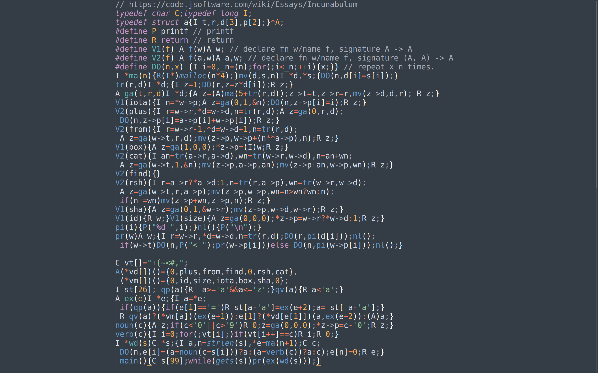

# Algorithms collection

All of these are written in Whitney style C++ as an exercise to learn his dense
programming style. As I understand, the argument for this style is that it
enables one to rapidly scan code. Since no scrolling is needed (all code fits
on a page), and variable names are very succinct (single letter or two letter),
it enables a high degree of cohesion when it comes to understanding code.

This sample screenshot of the famous
[Incunabulum essay in `J`](https://code.jsoftware.com/wiki/Essays/Incunabulum).
To quote the essay:

> One summer weekend in 1989, Arthur Whitney visited Ken Iverson at Kiln Farm
> and produced—on one page and in one afternoon—an interpreter fragment on the
> AT&T 3B1 computer. I studied this interpreter for about a week for its
> organization and programming style; and on Sunday, August 27, 1989, at about
> four o'clock in the afternoon, wrote the first line of code that became the
> implementation described in this document. Arthur's one-page interpreter
> fragment is as follows:



#### Code written in this style of common algorithms

- [`euc.cpp` - extended euclidian division](euc.cpp)
- [`qs.cpp` - quicksort](qs.cpp)
- [`qspar.cpp` - parallel quicksort](qspar.cpp)
- [`incunabulum.c` - original J incunabulum source](incunabulum.c)
- [`incunabulum-mine.c` - heavily annotated version by me](incunabulum-mine.c)

#### Shortes path algorithms

- **Djikstra:** single-source shortest path. Doesn't do well with negative cycles.
  Works by discretizing the real world simulation of burning fire across ropes
  into events. `O(V . smallest-in-queue + E . decrease-key)`.
- **Bellman ford:** Single source shortest path that works with negative cycles.
- `min, +` semiring: find all pairs shortest path by matrix expoentitation. Takes `O(V^3 log V)`.
- **Floyd Warshall:** All source shortest path. `O(V^3)`. Idea: use DP over shortest paths that
  have internal path nodes  numbered `<= r`. This gives us `dp[u][v][r]` as the shortest path from `u`
  to `v` that uses internal path nodes labelled at most `<= r` for some arbitrary labelling of nodes.
  so we start with `dp[u][v] 0 = dist[u][v]` and then check a new node `r` at each iteration.

#### Flows

- Ford-fulkerson (method): Choose augmenting path and send flow.
- Edmonds-Karp: `VE^2`. Find shortest path to send flow along.
- Dinic's: `V^2E` Use preflows instead of flows. With unit capacity, `min({V^2/3, E^1/2})`
- Push-relabel: `V^2E`. Implemented properly, can reach `V^3`. Use weird height metric to send flows.

#### Contests
- [abc153](https://atcoder.jp/contests/abc153)
- [forces1293](http://codeforces.com/contest/1293/)

#### Pragmas to GCC

```
#pragma GCC target ("avx2")
#pragma GCC optimization ("O3")
#pragma GCC optimization ("unroll-loops")
```

# Segment trees

an important thing to internalize is that this "node id" we give
in a segment tree is _arbitrary_. As are their ranges (open-closed, closed-closed),
etc. **none of these matter**. What matters is to **pick a convention**, and
_stick to it_ throughout the implementation. 
we generally assign `t*2` and `t*2+1` for the left and right child as indexes,
but really, these are completely arbitrary. as long as we maintain
disjoint ranges for each node, we're completely good. We know that 
we are *at an index* based on our ranges.

- If we are using `[l, r)`, then we are at a leaf node when `l == r+1`
- If we are using `[l, r]`, then we are at a leaf node when `l == r`
- When we walk to the left and right of the tree, we need some way to
  deterministically generate fresh labels. The most common ones are `
  tguid -> (tguid*2, tguid*2+1)`. This is called `tguid` since it's a global
  unique identifier. It's often confusing, since we might believe that this `*2`
  may have something to do with halving our range. It doesn't. We can just as
  well use `tguid -> (tguid*3, tguid*3+1)`. The important thing is that
  it must be bijective in both the left labelling function 
  and right labelling  function. We also usually want `tguid` to be small,
  since we will index an array with `tguid`. So, using `*2` and `*2+1`
  is the cheapest way to split the space.

```py
import math

def binstr(maxn, n):
    nbits = math.ceil(math.log(maxn, 2))
    bits = [1 if n & (1 << i) else 0 for i in range(0, nbits)]
    bits = bits[::-1]
    return "".join([str(b) for b in bits])

def tree_closed_open(tree_len, ix, l, length, depth):
    marker = ""
    if ix >= tree_len: marker = "*"

    print(" "*depth + "[%d---(%d:%s)--%d) %s" % (l, ix, binstr(1+tree_len, ix), l + length, marker))
    if ix >= tree_len:
        pass
    else:
        halflen = length//2
        r = l + length
        tree_closed_open(tree_len, ix*2, l, halflen, depth+1)
        tree_closed_open(tree_len, ix*2+1, l+halflen, length-halflen, depth+1)

def treestart_closed_open(tree_len):
    return tree_closed_open(tree_len, 1, 1, tree_len, 0)

def tree_closed_closed(tree_len, ix, l, r, depth):
    marker = ""
    if l == r: marker = "*"

    print(" " * depth + "[%d---(%d:%s)---%d] %s" % (l, ix, binstr(1+tree_len, ix), r, marker))
    if l == r: pass
    else:
        mid = (l+r)//2
        tree_closed_closed(tree_len, ix*2, l, mid, depth+1)
        tree_closed_closed(tree_len, ix*2+1, mid+1, r, depth+1)


def treestart_closed_closed(tree_len):
    return tree_closed_closed(tree_len, 1, 1, tree_len, 0)

if __name__ == "__main__":
    print("closed open:")
    treestart_closed_open(9)
    print("closed closed:")
    treestart_closed_closed(9)
```

# Flows

```cpp
int cap[N][N];
int flow[N][N];
int pred[N];
int totalflow;

int n, m, a, b;

bool augmentpath() {
    int vs[N]; int vp = 0;
    memset(pred, 0, sizeof(pred));

    vs[vp++] = S;
    pred[S] = (-1);
    while(vp > 0) {
        const int u = vs[--vp];
        // cout << "(considering:" << u << ")\n";

        if (u == T) { return true; }

        for(int v = 1; v < N; ++v) {
            // cout << "(" << u << " --(" << cap[u][v] << ")-->? " << v << ")\n";
            if (cap[u][v]  - flow[u][v] > 0 && !pred[v]) {
                // cout << "(" << u << " -> " << v << ")\n";
                pred[v] = u;
                vs[vp++] = v;  // push v to stack.
            }
        }
    }

    return false;
}

void solve() {
    ...
    memset(cap, 0, sizeof(cap));
    memset(flow, 0, sizeof(flow));
    memset(pred, 0, sizeof(pred));
    totalflow = 0;


    .. setup network
    while(augmentpath()) {
        int flo = INFTY;
        for(int v = T; v != S; v = pred[v]) { flo = min<int>(flo, cap[pred[v]][v] - flow[pred[v]][v]); }
        assert(flo > 0);
        totalflow += flo;
        for(int v = T; v != S; v = pred[v]) {
            flow[pred[v]][v] += flo;
            flow[v][pred[v]] -= flo;
        }
    }
```

- Interesting part is that *capacity `cap[N][N]` is constant*. Only mutate `flow[N][N]`.
- We send _positive flow_ in `(u, v)` direction, and send _negative flow_ 
  in `(v, u)` direction, which starts with `0` capacity. This gives us
  a "buffer" of, say, `-10...0`.


- Initial:
```
   flow:0/cap:10
u -----------------> v
   flow:0/cap:0
u <----------------- v
```

- On sending 5 flow along `u->v`

```
   flow:5/cap:10
u -----------------> v
   flow:-5/cap:0
u <----------------- v
```


# Elemetary data structures without STL

## Stack:

```cpp
int stk[N], int sp = 0;
void push(int val) { stk[sp++] = val; } int pop(int val) { stk[--sp] = val; }
```
## FIFO queue

```cpp
int q[N]; int hd = 0, len=0;
void qin(int val) { q[hd] = val; hd = (hd+1)%N; len++; }
int qout() { return q[(hd + --len)%N] }
```
# Codeforces-isms

```
https://codeforces.com/problemset?order=BY_SOLVED_DESC&tags=implementation
```

# Problems Spreadsheet

| Solved | Links                                        | Idea                                                  |
|--------| ----------------------------------------------|----------------------------------------------         |
|     N  | https://codeforces.com/contest/1437/problem/C	| hungarian                                             |
|     N  | https://www.youtube.com/watch?v=GLmNtIQFYYU     | monoid for substring match string concatenation     |
|     N  | https://codeforces.com/contest/1538/problem/E   | monoid for substring match string concatenation     |
|     Y  | https://codeforces.com/contest/1541/problem/D	  |                                                     |
|     N  | https://codeforces.com/contest/1541/problem/E1	|                                                   |
|     N  | https://usaco.guide/plat/sqrt?lang=cpp	        | sqrt decomposition                                |
|     N  | https://cp-algorithms.com/data_structures/sqrt_decomposition.html	| sqrt decomposition                |
|     N  | https://cses.fi/problemset/result/2428543/	| Two pointers does not work?                           |
|     Y  | https://codeforces.com/contest/545/problem/C	 | DP with multiple states (woodcutter)                 |
|     N  | https://codeforces.com/blog/entry/68138	     | DFS tree                                             |
|     Y  | https://codeforces.com/problemset/problem/166/E	 | DP on tetrahedron paths (cool states)            |
|     Y  | https://codeforces.com/contest/676/submission/18075788	| binary search for greedy                  |
|     Y  | https://codeforces.com/contest/1542/problem/C	        | Nice idea about what LCM, indicator fn        |
|     N  | https://codeforces.com/contest/1542/problem/D	        |                                               |
|     N  | https://codeforces.com/contest/1542/problem/E1	        |                                               |
|     Y  | https://codeforces.com/contest/1543/problem/C	        | how to compute expectation with floats        |
|     N  | https://codeforces.com/contest/1543/problem/E	        |                                               |
|     N  | https://codeforces.com/blog/entry/92602                  | DP with connected components
